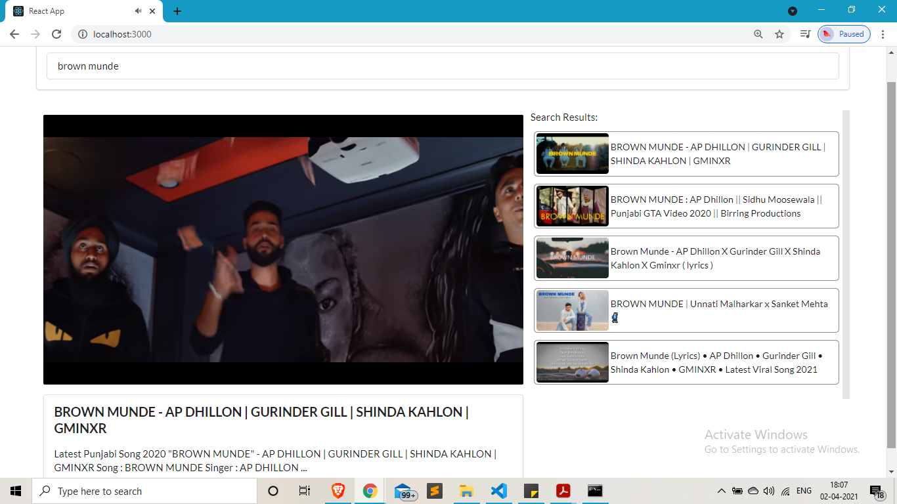

# A simple video search engine built using React
### API used: https://developers.google.com/youtube/v3/docs/search

> 
5 videos are received from the API in response of the query made.
On clicking the video from result list, user gets the video details and play screen(iframe).

> 
*Screenshots:*



## NOTE:
> 
In the src/Components Directory, there needs to be a file "youtube.js" with the axios configured with API Key
>
Here is what the file looks like 
> 
>
```
import axios from 'axios'

const KEY = 'YOUR-API-KEY-HERE'

export default axios.create({
    baseURL:'https://www.googleapis.com/youtube/v3',
    params:{
        part:'snippet',
        maxResults: 5,
        key: KEY
    }
});

```
